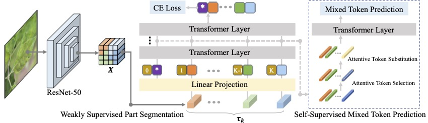

# Mix-ViT: Mixing Attentive Vision Transformer for Ultra-Fine-Grained Visual Categorization

Official PyTorch implementation of [Mix-ViT: Mixing Attentive Vision Transformer for Ultra-Fine-Grained Visual Categorization](https://www.sciencedirect.com/science/article/pii/S0031320322006112) accepted by Pattern Recognition. 

If you use the code in this repo for your work, please cite the following bib entries:

    @article{yu2023mix,
      title={Mix-ViT: Mixing attentive vision transformer for ultra-fine-grained visual categorization},
      author={Yu, Xiaohan and Wang, Jun and Zhao, Yang and Gao, Yongsheng},
      journal={Pattern Recognition},
      volume={135},
      pages={109131},
      year={2023},
      publisher={Elsevier}
    }


## Abstract
<div style="text-align:justify"> Ultra-fine-grained visual categorization (ultra-FGVC) moves down the taxonomy level to classify sub-granularity categories of fine-grained objects. This inevitably poses a challenge, i.e., classifying highly similar objects with limited samples, which impedes the performance of recent advanced vision transformer methods. To that end, this paper introduces Mix-ViT, a novel mixing attentive vision transformer to address the above challenge towards improved ultra-FGVC. The core design is a self-supervised module that mixes the high-level sample tokens and learns to predict whether a token has been substituted after attentively substituting tokens. This drives the model to understand the contextual discriminative details among inter-class samples. Via incorporating such a self-supervised module, the network gains more knowledge from the intrinsic structure of input data and thus improves generalization capability with limited training sample. The proposed Mix-ViT achieves competitive performance on seven publicly available datasets, demonstrating the potential of vision transformer compared to CNN for the first time in addressing the challenging ultra-FGVC tasks. </div>





## Prerequisites

The following packages are required to run the scripts:
- [Python >= 3.6]
- [PyTorch = 1.8]
- [Torchvision]
- [Apex]


## Download Google pre-trained ViT models

* [Get models in this link](https://console.cloud.google.com/storage/vit_models/): ViT-B_16, ViT-B_32...
```bash
wget https://storage.googleapis.com/vit_models/imagenet21k/{MODEL_NAME}.npz
```

## Dataset
You can download the datasets from the links below:

+ [CUB-200-2011](http://www.vision.caltech.edu/visipedia/CUB-200-2011.html).
+ [Cotton and Soy.Loc](https://drive.google.com/drive/folders/1UkWRepieAvEVEn3Z8n1Zx04bASvvqL7G?usp=sharing).


## Run the experiments.
Using the scripts on scripts directory to train the model, e.g., train on Soy.Gbl dataset.

    $ sh scripts/train_soygbl.sh
    
        
            
## Download Trained Models


[Trained model Google Drive](https://drive.google.com/drive/folders/1k1vqc0avk_zpCAVuLNZpVX-w-Q3xXf-5?usp=sharing)


## Acknowledgment
Thanks for the advice and guidance given by Dr.Xiaohan Yu and Prof. Yongsheng Gao.

Our project references the codes in the following repos. Thanks for thier works and sharing.
- [ViT-pytorch](https://github.com/jeonsworld/ViT-pytorch)
- [FFVT](https://github.com/Markin-Wang/FFVT)


